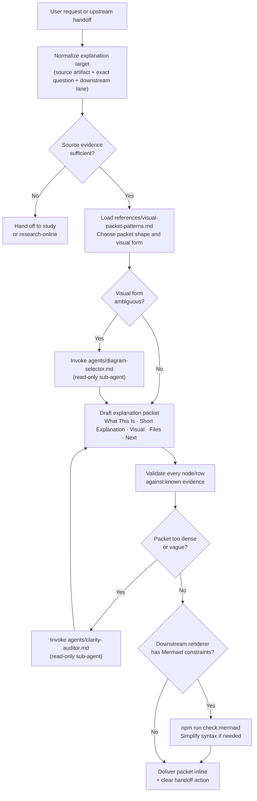

# explain
Translates an existing plan, study, spec cluster, decision packet, architecture path, or code flow into a compact explanation packet — concise prose plus the smallest set of visuals that materially improve understanding. It is a translation and presentation layer, not a research or planning workflow.

## Install

The fastest cross-agent install path is the `skills` CLI:

```bash
npx skills add gg-skills/explain
```

Drop this skill into a workspace as a Git submodule for pinned versions, or as a plain clone for latest `main`:

```bash
# Project-local, version-pinned:
git submodule add git@github.com:gg-skills/explain.git .claude/skills/explain

# OR project-local, latest main:
mkdir -p .claude/skills
git -C .claude/skills clone git@github.com:gg-skills/explain.git

# OR user-level, available in every project on this machine:
mkdir -p ~/.claude/skills
git -C ~/.claude/skills clone git@github.com:gg-skills/explain.git
```

Restart your agent or reload skills after installation. See the parent [`skills` catalog repo](https://github.com/gg-skills/skills) for the full catalog.

## When to use

Triggers from `SKILL.md`:

- The user explicitly asks to explain, summarize visually, make something easier to understand, or show the flow.
- A plan, study, spec set, decision packet, or code path already exists but is too dense for fast comprehension.
- Another workflow wants to offer a digestible explanation packet before planning or decision resolution.
- The task is about translating known local evidence, not collecting new evidence.

Skip when no explanation target or source artifact is available, when the request requires new evidence or new planning, when the source material is too contradictory or incomplete to explain honestly, or when the requested output medium has rendering constraints that cannot be satisfied.

## How it operates

### Inputs

| Input | Details |
|-------|---------|
| Source artifact | Any existing local artifact: plan file, study document, spec cluster, decision packet, runbook, code path, or explicit question with context supplied in the conversation. No remote fetching. |
| Explanation target | The exact question or concept to be explained, scoped by the user. |
| `references/visual-packet-patterns.md` | Read during step 2 to choose packet shape and visual form. |
| `agents/diagram-selector.md` | Read-only sub-agent prompt, invoked when more than one visual form is plausible. |
| `agents/clarity-auditor.md` | Read-only sub-agent prompt, invoked when a draft packet needs a second-opinion clarity pass. |
| Environment | No environment variables required. No network calls. No authentication. |

### Outputs

| Output | Format | Notes |
|--------|--------|-------|
| Explanation packet | Markdown prose rendered inline | Sections: What This Is, Short Explanation, Visual Explanation, Key Files / Contracts (optional), What To Do Next. |
| Primary visual | Mermaid diagram or ASCII or comparison table | Prefer Mermaid (`flowchart TD`, `sequenceDiagram`, `stateDiagram-v2`) or a markdown table. Cap at 1–2 visuals per packet. |
| Handoff context | Structured bullet list or table | Passed to `plan/SKILL.md`, `decisions/SKILL.md`, `study/SKILL.md`, or `chooseable-options/SKILL.md` when the explanation surfaces a clear next action. |

No files are written to disk. Output is delivered inline in the conversation.

### External commands

| Command | When used |
|---------|-----------|
| `npm run check:mermaid -- --files <packet.md>` | Optional: validates Mermaid syntax locally before publishing to a downstream renderer with constraints. Only needed when the packet will be committed or published. |

### Side effects

None. The skill reads existing artifacts and emits inline Markdown. It does not modify files, create branches, run agents in the background, or call external APIs.

### Mode toggles

| Condition | Behavior |
|-----------|----------|
| `agents/diagram-selector.md` available | Invoke as a native Codex sub-agent to select the strongest single visual before drafting. |
| `agents/clarity-auditor.md` available | Invoke as a native Codex sub-agent after drafting to pressure-test scan speed and fidelity. |
| Source evidence is thin or contradictory | Stop and hand off to `study/SKILL.md` or `research-online/SKILL.md` rather than guessing. |
| Downstream renderer has Mermaid constraints | Run `npm run check:mermaid` and simplify diagram syntax. |

## Operational flow



## Layout

```
explain/
├── SKILL.md                          # Skill description, triggers, workflow, policy
├── README.md                         # This file
├── agents/
│   ├── clarity-auditor.md            # Sub-agent prompt: clarity pass on draft packets
│   └── diagram-selector.md           # Sub-agent prompt: choose strongest single visual
├── assets/
│   ├── icon-large.png
│   ├── icon-large.svg
│   ├── icon-master.png
│   └── icon-small.svg
└── references/
    └── visual-packet-patterns.md     # Packet-shape chooser, scan-speed rules, inclusion heuristics
```

## Quick start

1. Point the skill at an existing artifact: paste file content, link a path, or describe the decision set.
2. State the explanation goal: "explain the auth flow", "make this spec scannable", "show how these components interact".
3. The skill returns a Markdown packet with a primary visual and a clear next action.

Example invocation:

```
/explain Explain how the request pipeline in src/middleware/ works, starting from the inbound HTTP request.
```

## Resources

- `references/visual-packet-patterns.md` — packet shape selection table, scan-speed rules, file-inclusion heuristics.
- `agents/diagram-selector.md` — sub-agent for choosing the strongest single visual type.
- `agents/clarity-auditor.md` — sub-agent for pressure-testing scan speed and fidelity.
- Cross-skill handoffs: `decisions/SKILL.md`, `study/SKILL.md`, `plan/SKILL.md`, `specs/SKILL.md`, `chooseable-options/SKILL.md`, `text-architecture`.

## Caveats

- **Translation only.** This skill does not perform research, collect new evidence, or make decisions. If the source artifact does not exist, invoke `study/SKILL.md` or `plan/SKILL.md` first.
- **Evidence-grounded.** Every visual node, table row, and file reference must map back to verified evidence. Do not cite repository paths that have not been confirmed.
- **1–2 visuals max.** Adding more diagrams slows scanning. Use tables for comparisons, a single Mermaid diagram for flow or state.
- **Mermaid rendering.** Mermaid syntax varies by renderer. Quote multi-word labels (`A["My label"]`) and validate with `npm run check:mermaid` before publishing to constrained renderers.
- **No persistent output.** The packet is delivered inline. If a permanent artifact is needed, the caller is responsible for writing it to disk.
